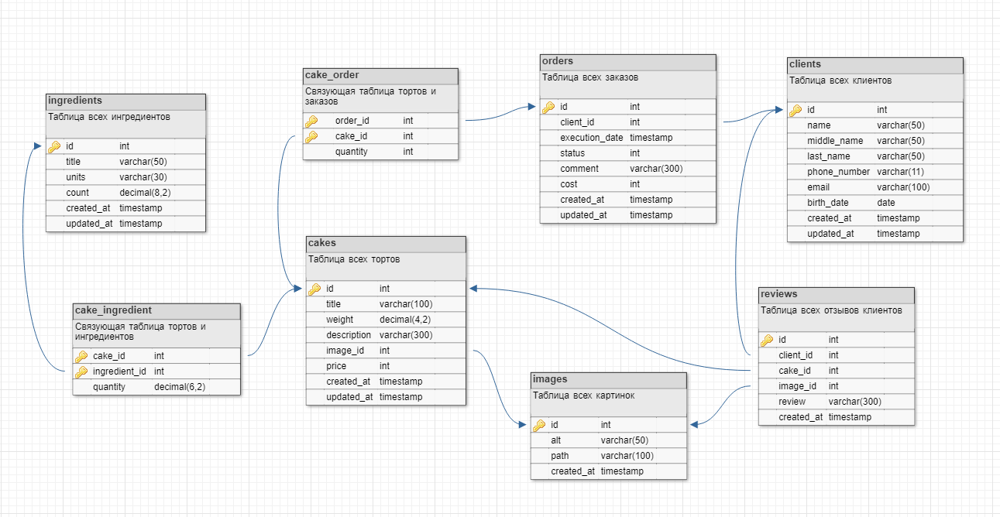

# База данных "Кондитерская"
**Цель проекта**: проектирование базы данных для системы автоматизации деятельности кондитерской.

## Структура базы данных

Код для создания таблиц базы данных "Кондитерская" приведен в файле *createTables.sql*.

### Описание таблиц
* **Сakes** — таблица всех тортиков (идентификатор, название, вес, описание, идентификатор картинки, цена, дата создания, дата изменения).
* **Ingredients** — таблица всех ингредиентов (идентификатор, название, единицы измерения, количество (в наличии), дата создания, дата изменения).
* **Сake_ingredient** — связующая таблица тортов и ингредиентов (идентификатор торта, идентификатор ингредиента, количество).
* **Clients** — таблица всех клиентов (идентификатор, имя, отчество, фамилия, номер телефон, электронная почта, дата рождения, дата создания, дата обновления). Клиент может заполнить только имя и телефон.
* **Orders** — таблица всех заказов (идентификатор, идентификатор клиента, дата выполнения, статус, комментарий к заказу, стоимость заказа (может не соответствовать стоимости товаров), дата создания, дата изменения).
* **Сake_order** — связующая таблица тортов и заказов (идентификатор заказа, идентификатор торта, количество тортов).
* **Images** — таблица всех картинок (идентификатор, альтернативный текст, путь к файлу, дата создания).
* **Reviews** — таблица всех отзывов клиентов (идентификатор, идентификатор клиента, идентификатор торта, идентификатор картинки, текст отзыва, дата создания). Отзыв может быть оставлен без привязки к определенному торту или без картинки.

### Описание связей между таблицами
* **Cakes и ingredients**: "многие ко многим" (разные ингредиенты могут быть в разных тортах). Для реализации связи создана связующая таблица сake_ingredient с полями cake_id и ingredient_id.
* **Cakes и orders**: "многие ко многим" (разные торты могут быть в разных заказах). Для реализации связи создана связующая таблица сake_order с полями cake_id и order_id.
* **Clients и orders**: "один ко многим" (один клиент может сделать множество заказов). Связь осуществляется через поле client_id таблицы orders.
* **Clients и reviews**: "один ко многим" (один клиент может оставить множество отзывов). Связь осуществляется через поле client_id таблицы reviews.
* **Images и reviews**: "один к одному" (одна картинка соотвествует одному торту). Связь осуществляется через поле image_id таблицы reviews.
* **Cakes и images**: "один к одному" (одна картинка соотвествует одному комментарию). Связь осуществляется через поле image_id таблицы cakes.

## Представления
* **Cakes_view** — полная информация о торте.  
#### Пример использования:  
    
    /* Узнать количество ингредиентов для торта «Фруктовый» */
    SELECT `cake_title`, `ingredient_title`, `quantity` 
    FROM `cakes_view`
    WHERE `cakes_title`;

* **Order_view** — полная информация о заказе.  
#### Примеры использования:

    /* Уточнить номер телефона клиента, сделавшего заказ */
    SELECT `order_id`, `client_name`, `client_phone_number` 
    FROM `order_view`
    WHERE `order_id` = 3;

    /* Уточнить состав заказа */
    SELECT `order_id`, `cake_title`, CONCAT(`quantity`, " шт.") 
    FROM `order_view`
    WHERE `order_id` = 4;

Код для создания представлений базы данных "Кондитерская" приведен в файле *views.sql*.

## Набор типовых данных для таблиц

Набор типовых данных для заполнения таблиц представлен в файле *insertData.sql*.

## Примеры типовых операций

Все примеры типовых операций продублированы в файле *typicalQueries.sql*. 

### Создание нового торта
    /* Добавление картинки для торта */  
    INSERT INTO `images` (`alt`, `path`, `created_at`) VALUES  
         ('Торт «Три шоколада»', 'chololate3.png', NOW()); 
    
    /* Добавление торта */  
    INSERT INTO `cakes` (`title`, `weight`, `description`, `image_id`, `price`, `created_at`, `updated_at`) VALUES   
         ('Торт «Три шоколада»', 1.89, 'Торт из шоколадного коржа, 3 видов мусса, украшенный шоколадной глазурью со свежими ягодами.', 10, 490, NOW(), NOW());
    
    /* Определение ингредиентов и их количества для торта */
    INSERT INTO `cake_ingredient` (`cake_id`, `ingredient_id`, `quantity`) VALUES   
        (7, 1, 400.00),  
        (7, 2, 1150.00),   
        (7, 3, 250.00);
  
### Обновление количества ингредиентов в наличии
    UPDATE `ingredients` SET `count` = 30.00 WHERE `id` = 5;
    
### Удаление ингредиента
    DELETE FROM `ingredients` WHERE `id` = 4;
    
    /* Удаление из связующей таблицы */
    DELETE FROM `cake_ingredient` WHERE `ingredient_id` = 4;
 
### Регистрация нового клиента
    INSERT INTO `clients` (`name`, `middle_name`, `last_name`, `phone_number`, `email`, `birth_date`, `created_at`, `updated_at`) VALUES 
        ('Юлия', 'Михайловна', 'Юшкевич', '89654734512', 'yulya@mail.ru', '1990-08-21', NOW(), NOW());
    
### Создание нового заказа 
    /* Добавление заказа */   
    INSERT INTO `orders` (`client_id`, `execution_date`, `status`, `comment`, `cost`, `created_at`, `updated_at`) VALUES 
         (5, '2018-06-10 16:00:00', 1, '', 900, NOW(), NOW());
    
    /* Определение состава заказа */ 
    INSERT INTO `cake_order` (`order_id`, `cake_id`, `quantity`) VALUES 
         (5, 1, 2);
    
### Изменение статуса заказа
    UPDATE `orders` SET `status` = 2 WHERE `id` = 1;
    
### Добавление нового отзыва
    /* С привязкой к определенному торту */
    INSERT INTO `reviews` (`client_id`, `cake_id`, `image_id`, `review`, `created_at`) VALUES 
        (3, 2, 12, 'Очень вкусный торт с оригинальным дизайном.', NOW());
    
    /* Общий отзыв (без привязки к определенному торту)  */
    INSERT INTO `reviews` (`client_id`, `cake_id`, `image_id`, `review`, `created_at`) VALUES 
        (5, NULL, NULL, 'Замечательная кондитерская! Заказываю тортики только тут.', NOW());
